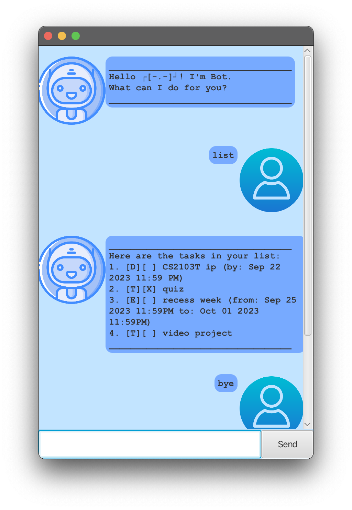

<!-- @@author {neyapraveen}-reused -->
<!-- Adapted from {hsiaotingluv} -->
# User Guide

This repo contains the code for Bot chatbot.

🤖Bot🤖 is a desktop chatbot application for managing and storing tasks,
with a Graphical User Interface (GUI).

Start chatting with Bot to achieve peak organization

--------------------------------------------------------------------------------------------------------------------

## Quick start

1. Ensure you have Java `11` or above installed in your Computer.

2. Download the latest `bot.jar` from [here](https://github.com/neyapraveen/ip/releases/latest).

3. On your terminal, cd to the directory the bot.jar is downloaded in  
   and run `java -jar bot.jar`

4. Try entering `help` and `list` commands. You should see the GUI as below.
   

6. Type the command in the command box and press Enter to execute it.
   e.g. typing **`help`** and pressing Enter will show you the list of commands. 
   Some example commands you can try:

   🤖 **`help`**: Shows all available command lines. 

   🤖 **`todo`**`complete assignment`: Adds a todo task `complete assignment` to the list. 

   🤖 **`list`**: Lists all the tasks in the list. 

   🤖 **`bye`**: Exits the program. 

7. Refer to the [Features](#features) below for more details on each command.

--------------------------------------------------------------------------------------------------------------------

## Features

**:quick note: Notes about the command format:** 

* Words in [ ] are the parameters the user needs to enter.  
  e.g. in `todo [task]`, `task` is a parameter e.g. `todo quiz`.

### 🤖 Add a todo task: `todo`

Adds a todo task to the list. 
Format: `todo [task]`

### 🤖 Add a deadline task: `deadline`

Adds a deadline task to the list. 
Format: `deadline [task] /by [dd-mm-yyyy] HHmm`

### 🤖 Add an event task: `event`

Adds an event task to the list. 
Format: `event [task] /from [dd-mm-yyyy] HHmm /to [dd-mm-yyyy] HHmm`

--> For deadline and event, if time is not specified, 
it will be stored as default 2359

### 🤖 List all tasks: `list`

Lists all the tasks in the list. 
Format: `list`

### 🤖 Mark task: `mark`

Marks a task with the specified index in the list as done. 
Format: `mark [index]` 

* The index refers to the index number of task in the list.
* The index must be valid and positive

### 🤖 Delete task: `delete`

Deletes a task with the specified index in the list. 
Format: `delete [index]`

* The index refers to the index number of task in the list.
* The index must be valid and positive

### 🤖 Find tasks: `find`

Finds all tasks with matching keyword. 
Format: `find [keyword]`

* Finds all tasks containing the `keyword` String.
* Case insensitive

### 🤖 View help: `help`

Shows a list of the available commands of Bot. 
Format: `help`

### 🤖 Exit program: `bye`

Displays farewell message. 
Format: `bye`

### 🤖 Save data

--------------------------------------------------------------------------------------------------------------------
### FAQ

**Q:** Do I have to save my data manually each time I use Bot?  

**A:** Bot saves data automatically in the local storage each time your
data is modified. There is no need to do this manually!

--------------------------------------------------------------------------------------------------------------------
## Known issues
1. Two tasks of the same type cannot have identical [task] descriptions. 
The duplicate task will not be reloaded when you rerun Bot. The remedy
is to ensure that tasks of the same type e.g., two events, do not have
the same name

--------------------------------------------------------------------------------------------------------------------

## Command summary

Action | Format, Examples
--------|------------------
**Todo** | `todo [task]`   e.g., `todo complete quiz`
**Deadline** | `deadline [task] /by [dd-mm-yyyy] HHmm`   e.g., `deadline submit iP /by 22/09/2023`
**Event** | `event [task] /from [dd-mm-yyyy] HHmm /to [dd-mm-yyyy] HHmm`   e.g., `event zoom call /from 22/09/2023 1600 /to 22/09/2023 1800`
**List** | `list`
**Mark** | `mark [index]`  e.g., `mark 3`
**Unmark** | `unmark [index]`  e.g., `unmark 1`
**Delete** | `delete [index]`  e.g., `delete 2`
**Find** | `find [keyword]`  e.g., `find th`
**Help** | `help`
**Exit** | `bye`
